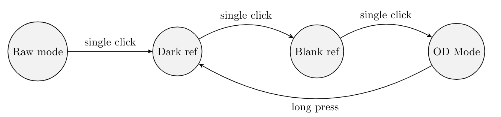

# ULC OD Meter

 This is the repository containing schematics and code for CZ Biohub's ULC OD Meter. 

## Getting Started
The latest Arduino IDE can be downloaded [on Arduino's website.](https://www.arduino.cc/en/software). Open `ODMeter_Program.ino` in the IDE. To upload code, select 'Board' as Arduino Nano or Arduino Micro. Select the port associated with the Arduino on the OD Meter to upload. 

*Important:* Please give the Arduino about 30 minutes to warm up before starting any measurements.

## Operating the OD Meter
The OD Meter has three different states, as seen below:

Regular line = Single click, dotted line = long press to move between states.

**Dark Ref Mode**
In dark ref mode, raw intensities are displayed with the label 'Dark intensity'. In this mode, place the dark cuvette in the cuvette holder, and press the button once to record the dark value.

**Blank Ref Mode**
In blank ref mode, raw intensities are displayed with the label 'Media intensity'. In this mode, place the blank reference (which can be media for bacteria, or clean water for water-based samples) in the cuvette holder, and press the button once to record the blank value. Collecting these dark and blank references are important in calibrating for the OD Readout mode.

**OD Readout Mode**
In OD readout mode, the measured OD is displayed on screen. If reference values need to be re-recorded, press down on the button until the prompt for inserting the dark reference is displayed on the screen.